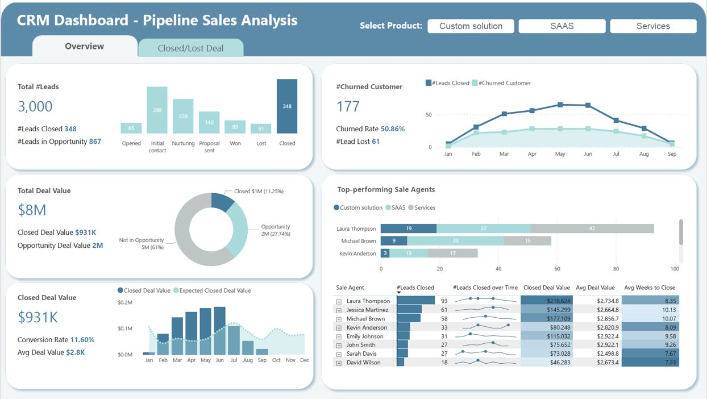

# CRM Pipeline Sales Analysis Dashboard

A data-driven CRM dashboard built to analyze sales pipeline performance, track lead progression, and identify top-performing sales agents across multiple product categories.

---

## Overview

This project provides an interactive **CRM Dashboard** for **Pipeline Sales Analysis**. It enables stakeholders to visualize key sales metrics, monitor deal progression through the pipeline stages, and evaluate sales agent performance — all filtered by product type.

---

## Features

- **Product Filter**: Segment data by product category — **Custom Solution**, **SAAS**, and **Services**
- **Dual-View Tabs**: Toggle between **Overview** and **Closed/Lost Deal** perspectives
- **Pipeline Funnel Visualization**: Track leads through stages — Opened, Initial Contact, Nurturing, Proposal Sent, Won, Lost, and Closed
- **Churn Analysis**: Monitor churned customers, churn rate, and lost leads over time
- **Deal Value Breakdown**: Donut chart showing distribution between Closed Deals, Opportunities, and Non-Opportunity leads
- **Closed Deal Performance**: Bar chart comparing Closed Deal Value vs. Expected Closed Deal Value monthly
- **Top-Performing Sales Agents**: Ranked leaderboard with metrics including Leads Closed, Closed Deal Value, Avg Deal Value, and Avg Weeks to Close
- **KPI Summary Cards**: Key metrics including Total Leads (3,000), Leads Closed, Leads in Opportunity, Total Deal Value ($8M), Closed Deal Value ($931K), Conversion Rate (11.60%), and Average Deal Value ($2.8K)

---

## Project Structure

```
CRM_Work/
├── CRM Excel Sheet.xlsx   # Source dataset containing CRM sales data
├── CRM.jpg                # Dashboard visualization screenshot
└── README.md              # Project documentation
```

---

## Data

The dataset (`CRM Excel Sheet.xlsx`) contains CRM sales pipeline records with fields such as:
- Lead information and status
- Product category (Custom Solution, SAAS, Services)
- Deal values and expected values
- Sales agent assignments
- Pipeline stage progression
- Churn indicators

---

## Dashboard Preview



---

## Key Metrics

| Metric | Value |
|--------|-------|
| Total Leads | 3,000 |
| Leads Closed | 348 |
| Leads in Opportunity | 867 |
| Total Deal Value | $8M |
| Closed Deal Value | $931K |
| Conversion Rate | 11.60% |
| Average Deal Value | $2.8K |
| Churned Customers | 177 |
| Churn Rate | 50.86% |

---

## Tools Used

- **Data Analysis**: Microsoft Excel
- **Visualization**: Dashboard built with Excel/Power BI (inferred from image)
- **Version Control**: Git & GitHub

---

## Author

**Mariam Iftikhar**

---

## License

This project is for portfolio and educational purposes.
